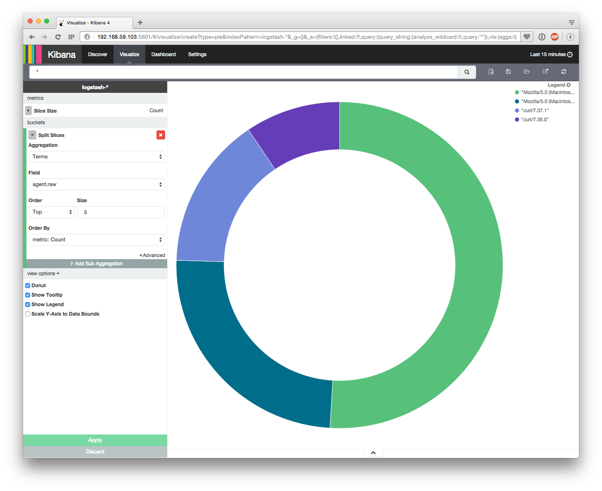
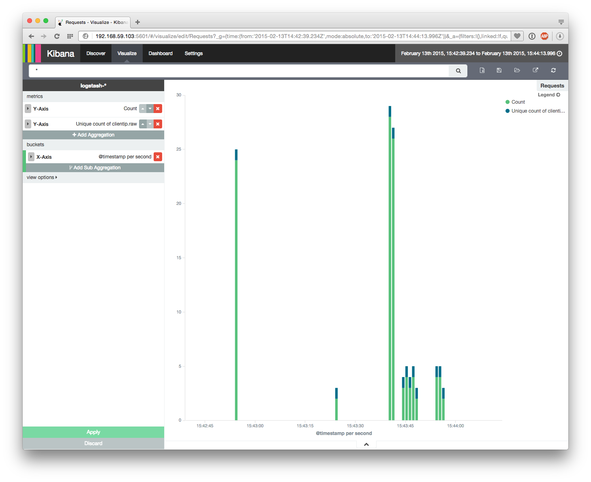
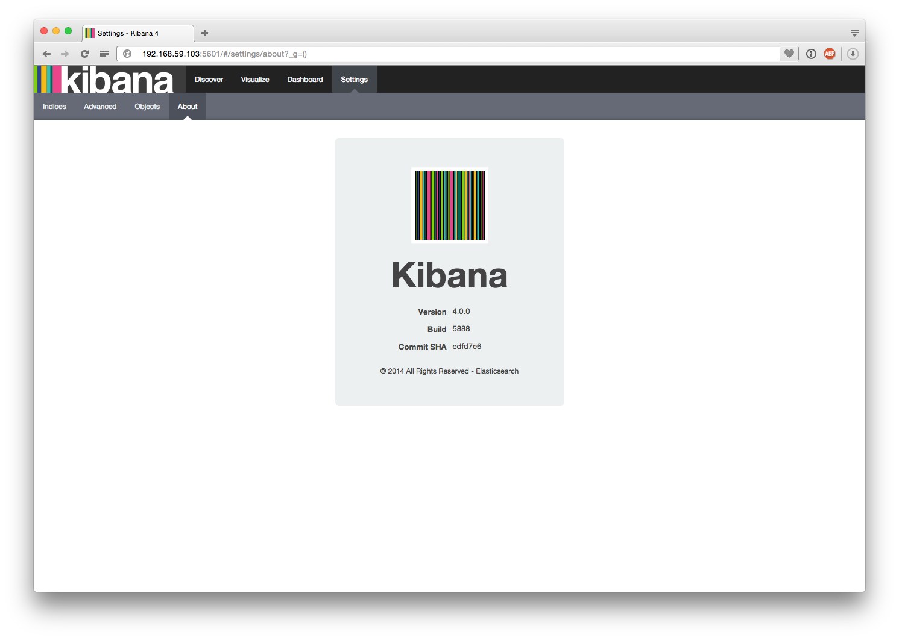

Docker-Script to create a simple, interactive Docker container for a complete ELK-Stack with [Elasticsearch](http://www.elasticsearch.com/products/elasticsearch/) / [Logstash](http://www.elasticsearch.com/products/logstash/) / [Kibana 4](http://www.elasticsearch.com/products/kibana/).

# Setup
```
--------------     --------------     --------------     --------------     --------------
|  Logstash  |     |            |     | Logstash   |     |  Elastic   |     |            |
|            | ==> |    Redis   | ==> |            | ==> |            | ==> |   Kibana   |
|  Shipper   |     |            |     | Indexer    |     |  Search    |     |            |
--------------     --------------     --------------     --------------     --------------
```

# Building the Container
```
docker build -t=kibana .
```

# Running the Container

```
docker run -i -t -p 5601:5601 -p 9200:9200 -p 80:80 kibana /bin/zsh
➜ ./startup.sh
```
## Services on the Container
After the `startup`-Script, the following services are available:
- [Kibana](http://192.168.59.103:5601/)
- [Marvel](http://192.168.59.103:9200/_plugin/marvel/kibana/index.html#/dashboard/file/marvel.overview.json)
- [Bootstrap sample page from startbootstrap.com](http://192.168.59.103)

# Usage
Entries in the `syslog` and the `nginx-access` log will be processed by logstash and stored in elasticsearch. You can add log-entries to the `syslog` with `logger` eg.

```
logger FINDME
```
Or you can visit the [Bootstrap Sample Page](http://192.168.59.103) to create Nginx Access Logs.

# Screenshots




